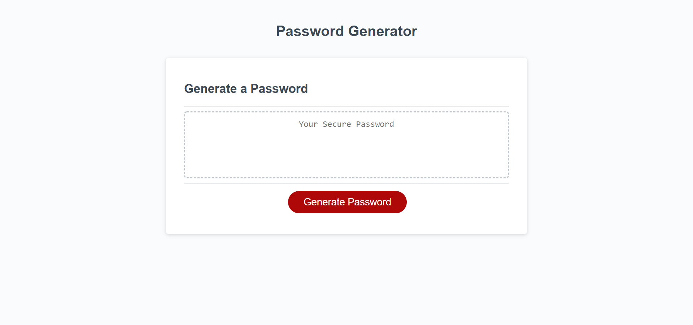
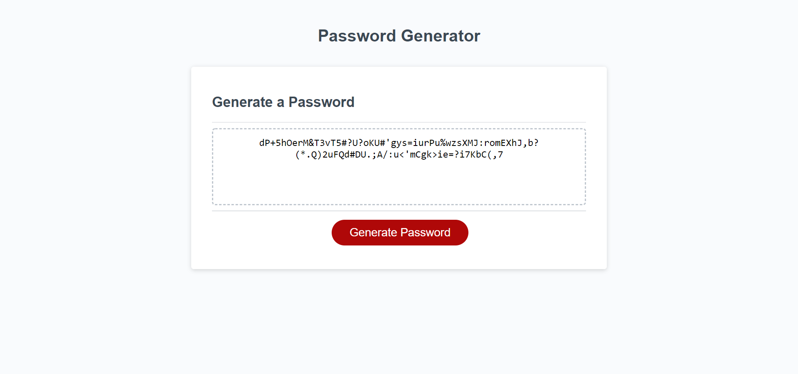

Password Generator

This program is designed to have you click a "Generate Password" button. It then triggers a series of questions that must be successfully answered in order to receive a code that is up to your specifications.

It will ask how many characters you want your password to be. You must choose between or equal to 8-128 digits.
It will then ask you if you want UPPERCASE LETTERS in your password.
It will then ask you if you want lowercase letters in your password.
It will then ask you if you want whole numbered digits in your password.
It will then ask you if you want special characters included in your password.
If any answer is not correctly answered it will kick you to the beginning.
It will then display your choices and will ask you to confirm or reject choices.
If you select NO on all four choices it will force you to the beginning of the prompts to start over.
It will then generate a random code based on the criteria you selected and display the answer on the webpage that has been designed to
accommodate smaller screen sizes.

